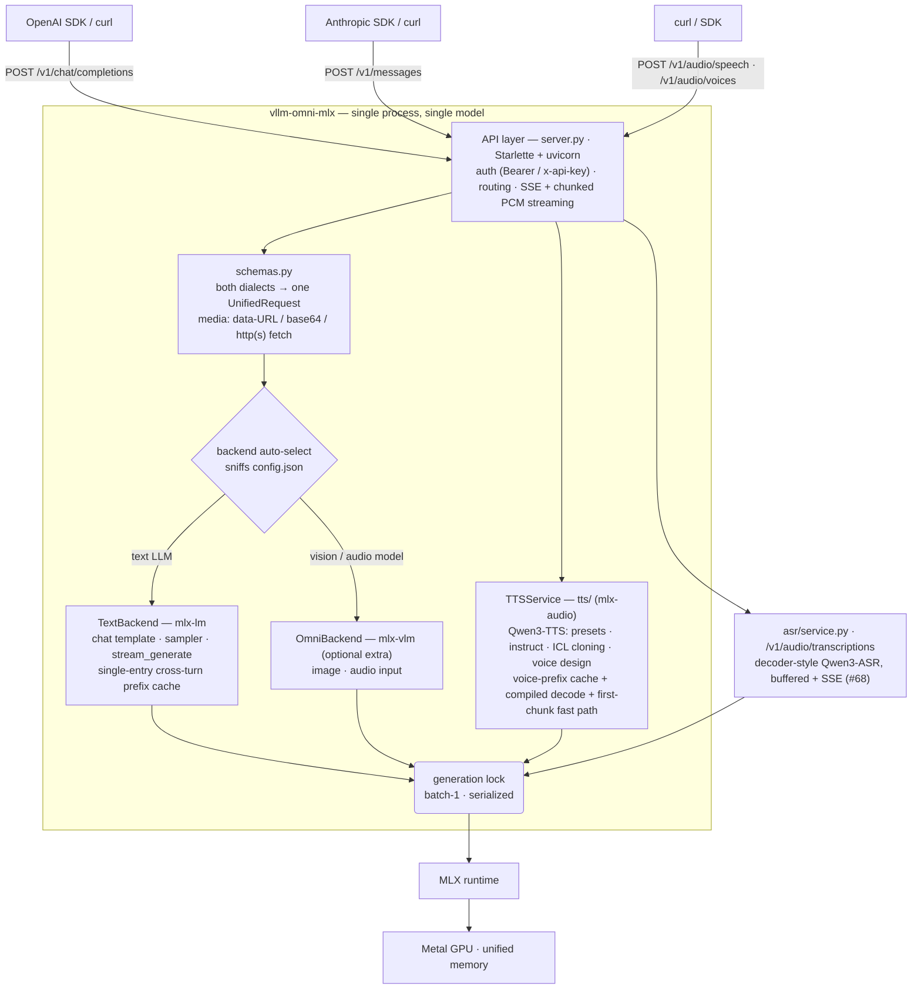

# Architecture

One process, one model, one request at a time — the whole design optimizes for
**batch-1 latency on Apple Silicon** instead of throughput serving.

## Layers

| Layer | File | Responsibility |
| --- | --- | --- |
| API layer | `server.py` | OpenAI and Anthropic dialects over the same core; speech endpoints (`/v1/audio/speech`, `/v1/audio/voices`); request auth; SSE and chunked-PCM streaming (sync generation bridged from a worker thread into the event loop) |
| Normalization | `schemas.py` | One internal `UnifiedRequest` for both chat APIs; text/image/audio parts; eager media decoding with a 25 MiB remote-fetch cap |
| Backends | `backends.py` | `TextBackend` (mlx-lm) and `OmniBackend` (mlx-vlm); auto-selection by model config; stop-sequence filtering; generation serialized under a lock |
| ASR serving | `asr/service.py`, `asr/capabilities.py` | Decoder-style speech recognition (`/v1/audio/transcriptions`): the capability matrix rejects unserved families at boot, request validation and decode run before the lock, buffered or SSE-streamed text; the OpenAI `prompt` field is the decoder's static prompt head |
| TTS serving | `tts/service.py` | Request validation (voice strings vs cloning objects vs design instructions → 400s with guidance), output formats (wav / raw pcm), the generation lock |
| TTS pipeline | `tts/` | `config`/`variants` (checkpoint typing + path×type dispatch), `generate` (buffered) and `stream_loop` (streaming fast path), `prompt_embeds` + `prefix_cache` (per-voice prompt pieces + static-prefix KV reuse), `compiled_steps` (mx.compile'd talker/predictor/sampler closures), `code2wav`/`talker`/`code_predictor` seams |
| Runtime | MLX | Model execution on the Metal GPU over unified memory |

## Why it looks like this

- **Batch-1 by design.** A lock serializes generation; concurrent requests queue.
  No scheduler, no continuous batching — the target is one user, lowest latency.
  Upstream's paged KV / block tables are absent for the same reason, which is
  why prefix caching here (chat cross-turn, TTS per-voice) has none of the
  first-audio conflicts that make upstream disable theirs.
- **Two dialects, one core.** API differences (finish reasons, SSE event shapes,
  media encodings) end at `schemas.py`; backends never know which API called.
- **Clean backend boundary.** `Backend.chat()` is the only contract. If Python
  orchestration ever becomes the latency wall (plausible only for sub-1B models),
  a Rust frontend over an MLX worker — the system1-omni pattern — can replace the
  layers above the boundary without touching model code.
- **Latency levers live behind the lock, and they are landed.** Chat: the
  cross-turn prompt cache, `--draft-model` / `--kv-bits` flags. TTS: the compiled
  decode closures (#65), the per-voice prefix cache with bitwise-reproducible
  streams (#66), and the single-frame first chunk (#77) — first audio in
  ~0.1 s on a warm voice. Measurement methodology in
  [profiling.md](profiling.md); the per-checkpoint battery is
  `scripts/bench_all_checkpoints.py`.
- **No native model code.** `tts/` is a seam layer: the loops vendor control
  flow over mlx-audio's components (MIT), and the compiled closures mirror their
  module bodies — model math stays in the library, which tracks upstream
  Qwen3-TTS fixes for free.
